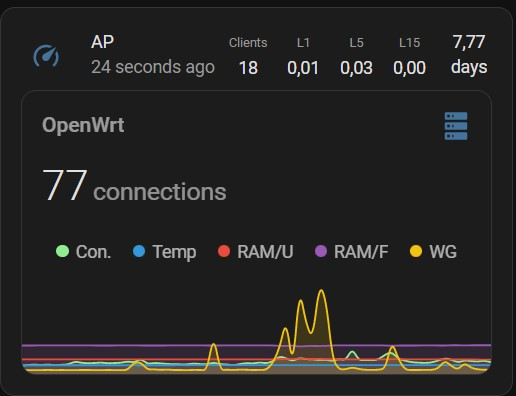

# OpenWRT-collectd-MQTT-HA
OpenWRT Collectd to MQTT with Homeassistant Template

# OpenWRT
Reguirements:
```shell
collectd
collectd-mod-mqtt
collectd-mod-* optional modules
```
 
`vi  /etc/collectd.conf`

Add listed below configuration:
```shell
LoadPlugin mqtt
<Plugin "mqtt">
  <Publish "OpenWRT">
    Host "192.168.0.1"
    Port "1883"
    User "user"
    Password "Password"
    ClientId "OpenWRT"
    Prefix "collectd"
    Retain true
  </Publish>
</Plugin>
```

# HA configuration
Add config to your HA configuration file.
[configuration.yaml](configuration.yaml) 
Add config to your HA lovelace file.
[lovelace.yaml](lovelace.yaml) \


# Troubleshooting
Check received data on MQTT server: \
 `mosquitto_sub -h localhost -p 1883 -u user -P Password -t collectd/# -d`
